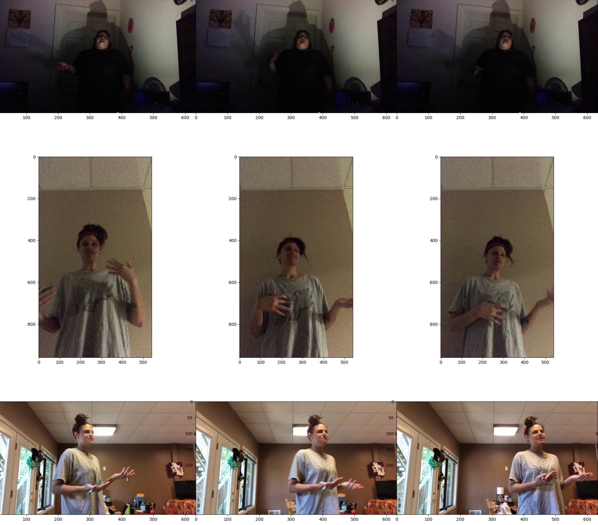

# CV Final Project: Deepfake Detection

## Description

This project is inspired by Kaggle's Deepfake Detection Challenge in collaboration with Meta.  The challenge is to create an algorithm that detects whether or not faces in a video has been altered with facial-modification technologies to create "deepfakes".  The dataset provided by Meta consisted of 115,000 videos, sourced from ~3,500 paid actors.  The dataset can be accessed by the Meta link below, or the Kaggle challenge (includes smaller packages for download).  Our implementation uses a convolutional neural network to train on the features of real and fake videos in order to generate predictions.

- [Facebook Deepfake Detection Challenge (DFDC)](https://ai.facebook.com/datasets/dfdc/)
- [Deepfake Detection Challenge Results: An open initiative to advance AI](https://ai.facebook.com/blog/deepfake-detection-challenge-results-an-open-initiative-to-advance-ai/)
- [Kaggle: Deepfake Detection Challenge](https://www.kaggle.com/competitions/deepfake-detection-challenge/data)

<p align="center">

</p>

<br>

## Setup

Our code was run in a conda environment with the necessary packaged installed on an NVIDIA GPU (Brown CS department machines).

### pip/conda packages used

- Python 3
- Keras
- pandas
- numpy
- TensorFlow
- EfficientNet 
- matplotlib
- PySpark
- seaborn
- OpenCV
- sklearn
- json
- MTCNN

Packages involved in the running of the program on the NVIDIA GPU include:
- cudnn
- nvidia-tensorrt
- tensorrt
- tensorflow-gpu
- cudatoolkit

This repository contains a file run_GRID_GPU.sh that initializes our conda environment with the needed packages, flags, and path settings.

<br>

## The Program

#### Step 0 - Convert the video into image frames

```
run locally:
python 00-convert_video_to_image.py

run on Brown department GPUs:
qsub -l day -l vf=4G -l gpus=1 -N JOBNAME_task00 run_GRID_GPU.sh 00-convert_video_to_image.py -cwd
```

After saving the dataset (mp4 videos and a json with whether each video is real or fake) in a directory called train_sample_videos, this program loops through each video and extracts 11 frames from each.  It creates a directory with the same name as the video title, and saves the 11 frames as png files in the folders.  It also standardizes the sizes of the images.

<p align="center">

</p>

<!--  -->

#### Step 1a - Crop areas of interest from the image frames by extracting faces

```
run locally:
python 01a-crop_faces_with_mtcnn.py

run on Brown department GPUs:
qsub -l day -l vf=4G -l gpus=1 -N JOBNAME_task01a run_GRID_GPU.sh 01a-crop_faces_with_mtcnn.py -cwd

```

In order to prevent the convolutional neural network from being misled by background or distracting features, we crop the images into a box containing just the face.  The faces are detected using [Python package MTCNN](https://github.com/ipazc/mtcnn), with a 95% confidence threshold.  If there are multiple people in a video, multiple faces are saved.  These faces are saved within the directory for each video, in a new directory called "faces".

<p align="center">

</p>

#### Optional Step 1b - Plot red points on key facial features

```
python 01b-face_detection_visualize.py

run on Brown department GPUs:
qsub -l day -l vf=4G -l gpus=1 -N JOBNAME_task01b run_GRID_GPU.sh 01b-face_detection_visualize.py -cwd

```

MTCNN also generates fields with the coordinates of key facial features, include the eyes, nose, and corners of the mouth.  An optional, additional preprocessing step that we tested is plotting red coordinate points on these key facial features on the cropped images.  These faces are saved within the directory for each video, in a new directory alongside "faces", called "marked_faces".

<p align="center">

</p>

#### Step 2 - Separate the face frames into real/fake sets, then training/testing/validation sets 

```
python 02-prepare_fake_real_dataset.py

run on Brown department GPUs:
qsub -l day -l vf=4G -l gpus=1 -N JOBNAME_task02 run_GRID_GPU.sh 02-prepare_fake_real_dataset.py -cwd
```

This program loops through metadata.json in the train_sample_videos directory and separates the frames from each video-titled directory containing cropped face-frames into real and fake directories. The Meta dataset has significantly more fake videos/faces than real ones, and this lowers CNN accuracy.  Thus, we downsample the fake faces such that the numbers match, and we do so by deleting alphabetically-consecutive faces.  This step generates prepared_dataset, with subdirectories "fake" and "real".

This parallelizes the real/fake sets, so they have similar numbers of videos (contrasted with randomly selecting fake faces to delete, which would keep a lot of videos, but few frames per video).  Then, the real and fake sets are split equally into training (10% of the number of faces), validation (10%), and training (80%) sets, also by splitting consecutively.  This prevents the same video from showing up in any two of the sets, which could lead to falsely high CNN results.  This step creates split_dataset, with subdirectories "train", "test", "val", and each have "real" and "fake" subdirectories.

#### Step 3 - Model training

```
python 03-train_cnn.py

run on Brown department GPUs:
qsub -l day -l vf=4G -l gpus=1 -N JOBNAME_task03 run_GRID_GPU.sh 03-train_cnn.py -cwd
```

Our CNN uses an EfficientNetB0 head because the Meta challenge results said that the winners all used Google's pre-trained model.  The connected layers are two dense layers, and a final dense layer with sigmoid activation to generate decimal results between 0 and 1.  A prediction is generated for each face-frame (not each video!) and predictions close to 1 mean it is confident that the face is real, and close to 0 means it is likely fake.  This program generates Loss and Accuracy graphs from matploblib (Loss.png, Accuracy.png), a confusion matrix for the predictions (Confusion.png), and the predictions in the form of cnn_preds_values.json, as well as a directory tmp_checkpoint with best_model.h5 in it with the weights of the model with the highest validation accuracy.

#### Step 3a - intermediate program Load Model
```
python 03a-load_cnn.py

run on Brown department GPUs:
qsub -l day -l vf=4G -l gpus=1 -N JOBNAME_task03a run_GRID_GPU.sh 03a-load_cnn.py -cwd
```

This program is a tool that can load weights (the best_model.h5 file outputted from Step 3) and generate predictions on the test set.

#### Step 4 - Turn predictions on each face-frame into predictions on each video

```
python 04-process_preds.py
```

This step uses PySpark and the MapReduce technique on the cnn_preds_values.json file outputted by Step 3.  In order to get the overall prediction of real or fake on a video, we needed to average the predictions on each face-frame corresponding to this video, and this requires a lot of linear operations, which is why the parallelization of PySpark makes this very efficient.  From this step, there is an outputted file mapreduce_res.txt containing the video-prediction accuracy (rounding each prediction to 1 or 0 and comparing them with the correct labels), the average decimal prediction for each video (real videos should average close to 1, fake close to 0), and a table with the predictions versus the correct answers.  It also outputs a confusion matrix, ConfusionVideo.png.  

#### ADDITIONAL TOOL: (Step 5) - Generate image grids
```
python 05-image_grid.py
```

Create a directory of images (preferably with a square number), input the filename of this directory into the images_dir variable, select a name for result_grid_filename, and run to generate a jpg file with the photos in a grid.  Used for generating result visualizations.


## Authors

* **Emily Wang** - [emilyaw24](https://github.com/emilyaw24)
* **Hannah Jeon** - [j200183](https://github.com/j200183)
* **Ria Rajesh** - [rrajesh1](https://github.com/rrajesh1)
* **Jennifer Wang** - [jennjwang](https://github.com/jennjwang)

